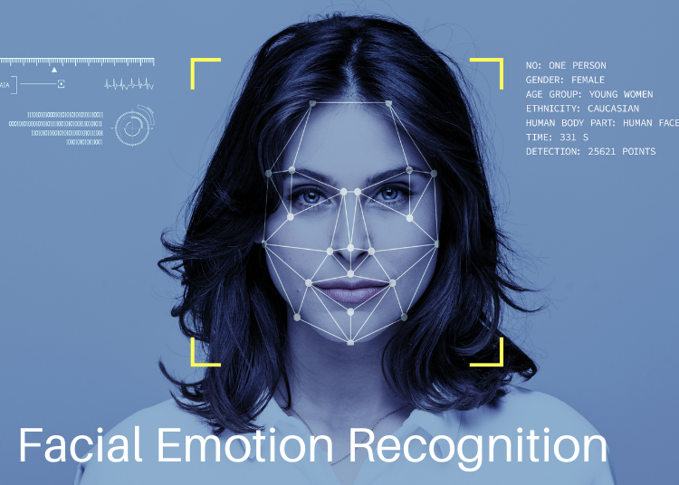

 
  
<h1 align="center"> Face-emotion-Recognition Alma Better Project </h1> 
     

 

<h2> :book:Introduction</h2>
Facial expressions are a form of nonverbal communication. Various studies have been done for the classification of these facial expressions. There is strong evidence for the universal facial expressions of seven emotions which include: neutral happy, sadness, anger, disgust, fear, and surprise. So it is very important to detect these emotions on the face as it has wide applications in the field of Computer Vision and Artificial Intelligence. These fields are researching on the facial emotions to get the sentiments of the humans automatically.

 
<h2> :book:Problem Statements</h2>
The Indian education landscape has been undergoing rapid changes for the past 10 years owing to the advancement of web-based learning services, specifically, eLearning platforms.
Digital classrooms are conducted via video telephony software program (ex-Zoom) where it’s not possible for medium scale class (25-50) to see all students and access the mood. Because of this drawback, students are not focusing on content due to lack of surveillance.

While digital platforms have limitations in terms of physical surveillance but it comes with the power of data and machines which can work for you. It provides data in the form of video, audio, and texts which can be analyzed using deep learning algorithms.

Deep learning backed system not only solves the surveillance issue, but it also removes the human bias from the system, and all information is no longer in the teacher’s brain rather translated in numbers that can be analyzed and tracked.

I will solve the above-mentioned challenge by applying deep learning algorithms to live video data. The solution to this problem is by recognizing facial emotions.

<h2> 🔗:Dataset link</h2>
(https://www.kaggle.com/deadskull7/fer2013)

# 
<h2> :book:Conclusion</h2>
1. All the models such as Mobilenet, Dexpression, CNN, Densenet, and ResNet were evaluated.
2. The ResNet model was chosen because it had the highest training accuracy of all the models, and its validation accuracy was nearly 72 percent, which is comparable to CNN models.
3. As a result, we save this resnet model and use it to predict facial expressions.
4.Since, the emotion counts of disgust and surprise images are less therefore on local webcam it hardly detect those emotions.
5. Using streamlit, a front-end model was successfully created and ran on a local webserver.The Streamlit web application has been deployed on Amazon's AWS cloud platform.
6. It was an amazing and fascinating project. This has taught me a lot.
